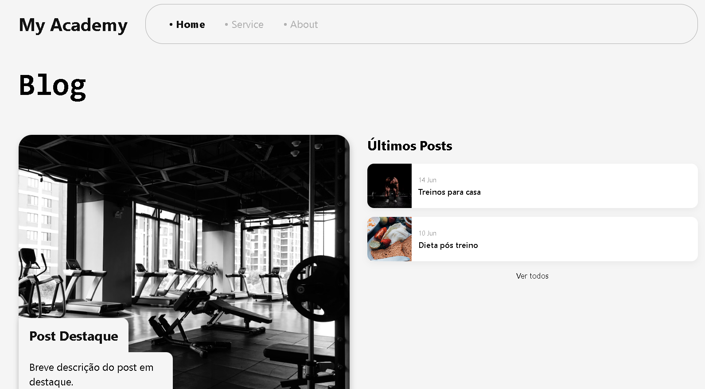

# Nome do Projeto

Breve descrição do projeto e o que ele faz.

---

## Visão Geral

Este projeto conta com uma interface ilustrada pela imagem abaixo:



---

## Créditos das Imagens

As imagens usadas neste projeto são do Unsplash, plataforma de fotos gratuitas e de alta qualidade.

A imagem ilustrativa original foi criada por [criador no Dribbble](https://dribbble.com/shots/6518782), acessada via link direto.

---

## Como usar

1. Clone o repositório:
   ```bash
   git clone https://github.com/seu-usuario/seu-repositorio.git
